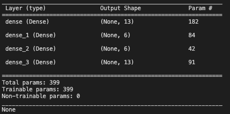
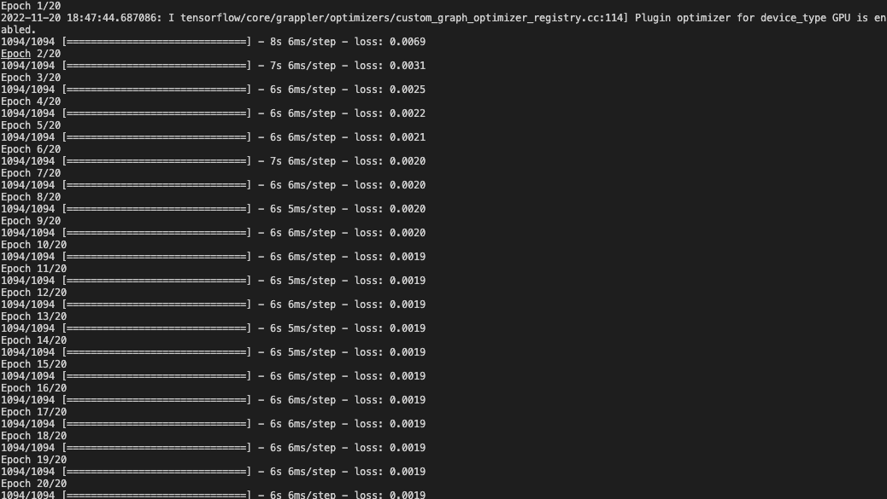

# Anomaly Detection Using Autoencoders

## Credit Card Fraud Dection

## Overview

### Business Problem

1. **Objective**
   - To assess if a transaction is fraudulent from the given credit card data
   - Learn from various features of normal transactions to distinguish fraudulent transactions 

2. **Machine Learning Problem**
   - Develop a machine learning model based on deep auto-encoders to learn distribution and relation between the features of normal transactions


3. **Technology**
   - Python, Scikit-learn, TensorFlow, Keras, Pandas, Numpy
   

4. **Metrcs**
   - Metrics: MSE (Mean Squared Error)
   

5. **Deployment**
   - Deploy model in a scalable way so that business decisions can be taken in near real time in assessing riskiness of a transaction

6. **Approach**

   - Exploratory Data Analysis  
   - Data Cleaning
   - Build a base auto-encoder model using Keras
   - Evaluate and Tune the model 
   - Make Predictions

7. **Deployment**
   - Serve model as API endpoint using Flask
   - Perform real-time predictions


`python Engine.py`

  ``` 
   Train - 0
   Predict - 1
   Deploy - 2
```
```
Enter your value: 0
```
```
Data loaded into pandas dataframe
Preprocessing has begun...
Data cleaning has completed...
Data normalization has completed...
Preprocesing is complete...
```




